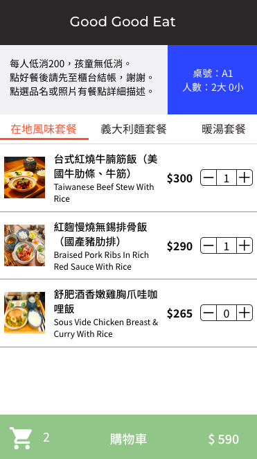
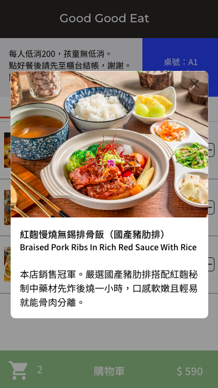

# POS 點餐系統 (for restaurant & for customer)

此專案為 Good Good Eat 打造點餐 POS 系統。

專案分為兩部分：

- 供管理者管理訂單的管理系統，畫面設計為平板橫式。
- 供客人使用自己的手機點餐，點餐後再到櫃檯結帳，畫面設計為手機直式。
  <br/>
  <br/>

## GitHub Page

https://jamielolo.github.io/POS-system/
<br/>
<br/>
【 管理者 】
<br/>
帳號：admin
<br/>
密碼：12345678

【 顧客 】
<br/>
桌號：A1 ~ A7、B1 ~ B8
<br/>
**若出現未開桌訊息，請換桌號，或是至管理系統開桌。**
<br/>
<br/>

## 專案部分畫面

【 管理者 - 登入頁面 】

【 管理者 - 點餐入口 】

【 管理者 - 點餐頁面 】

【 管理者 - 帳務相關頁面 】

【 管理者 - 設定相關頁面 】

【 管理者 - 設定相關頁面 】

【 顧客 - 點餐畫面 】

<div></div>
【 顧客 - 餐點詳細介紹 】
<div></div>
【 顧客 - 訂單內容 】
<div></div>
<br/>
<br/>

## 專案功能

附於 <a href="https://www.notion.so/b94d811bceb34b90a6587938652d99b8">操作指南</a>
<br/>
<br/>

## 環境建置

- react: 18.2.0
- react-scripts: 5.0.1
- react-router-dom: 6.6.1
- react-redux: 8.0.5
- This project was bootstrapped with [Create React App](https://github.com/facebook/create-react-app).

<br/>
<br/>

## 專案安裝流程

1. 打開終端機，下載此專案。

```
git clone https://github.com/JamieLoLo/POS-system
```

2. 進入專案資料夾

```
cd POS-system
```

3. 安裝套件

```
npm install
```

4. 啟動專案

```
npm start
```

5. 使用者登入網址位於

```
http://localhost:3000/POS-system/#/customer/login
```

5. 管理者登入網址位於

```
http://localhost:3000/POS-system/#/admin/login
```

6. 退出專案可使用以下快捷鍵

```
control + C
```

</br>
</br>

## 專案開發人員

<a href="https://github.com/JamieLoLo">Jamie Lo</a> & <a href="https://github.com/OneZerocococo">10</a>
